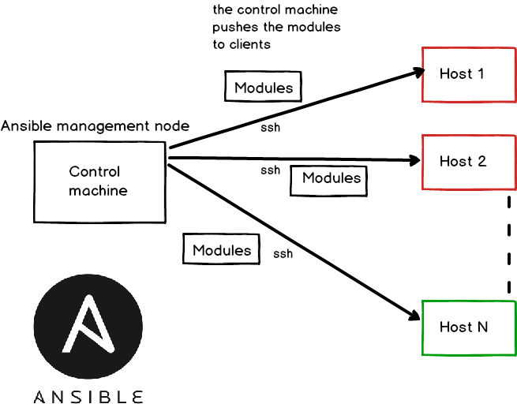
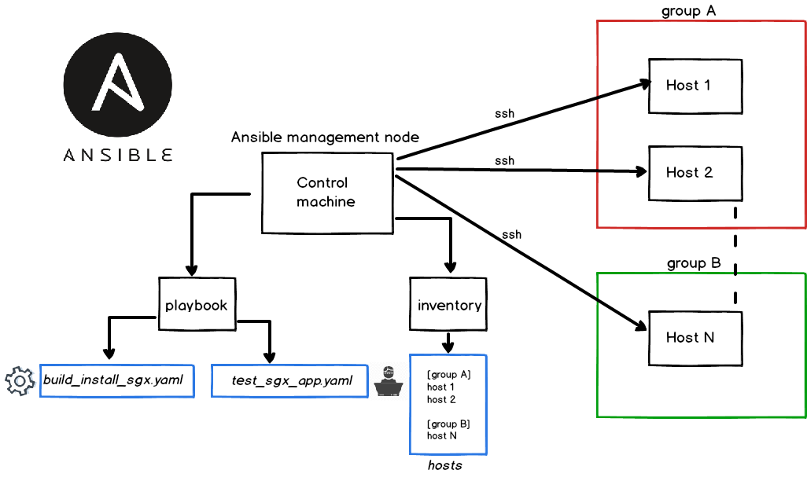

# Why Ansible?

## General information
Ansible is a software provisioning, configuration management and applicated-deployment tool.   
It is easy to deploy as it does not use any agents => **agentless** property.
To describe automation jobs, a **playbook** which contains multiple tasks is used. The language used is YAML (Yet Another Markup Language - used commonly for configuration files) which is very easy to understand, read or write as it is in a human readable form. 
  
In Ansible there exists 2 types of machines:
- **control machine**: works like a server that administrates a number of clients
- **remote machine** (the client/clients): handled by the control machine (the server). The **agentless** property stated above refers to using a connection like ssh (by default) or Kerberos for remote management. After the connection is done, Ansible pushes small programs called 'Ansible modules' that are run on nodes and after the process is completed they are removed. 

See below a diagram that represents a *general overview of the setup*:



## Playbooks and inventories
A **task** is a single action (install packets, run a command, delete a file etc.) that is managed by Ansible. Think of a Junit testcase that contains a number of tests done to verify a configuration (where a test is equal to a task here). A **playbook** has multiple tasks, is written is YAML format and executed on a machine.  
Example of a task in a playbook:
```console
user@host $ cat sample_playbook.yaml
[...]
- name: "Install the required tools for compiling code - gcc"
      apt:
        name: gcc
        state: latest
        update_cache: yes
[...]
```
The hosts are kept in a configuration file called **inventory**. There is required to define the IPs/hostnames and optionally add a connection type (local or ssh) and the remote user to connect (is there is no user added, it will use the same one from the control machine). They can also be classified in groups (for example, we may have computers on marketing department on which there are some specific tools to be installed and a research one with different programs).  

The inventories can be written in the INI format (Ansible's default one - see below a sample) or YAML.

Example of an inventory with 2 groups:
```console
user@host $ cat hosts_file
[MKT]
127.0.0.1 	   ansible_connection=local ansible_user=user
172.27.100.200 ansible_connection=ssh   ansible_user=user

[RESEARCH]
172.17.200.200   ansible_connection=ssh ansible_user=user
```
  


**Note**: you can also manage your local system using Ansible by configuring a group in inventory with the localhost address, connection type local and the user (see an example in the section: [Running example pictures](https://github.com/hstoenescu/SGX-setup-install#running-example-pictures)).

## Ansible ad-hoc vs. ansible-playbook
### Ad-hoc
An **ad-hoc command** is just a test you want to do something really quick without saving it to a file. Is the same as testing python functions in the interpreter. This is a good start for learning Ansible and then move forward to write playbooks. It is also good for small operations, like verifying a service is up.  
The Linux command is simply '**ansible**' (it comes with the ansible installer - see below the **installation discussed**).  

Examples of running an ad-hoc command:  
```console
## Format used for running with 'ansible command':
# ansible [group_name] -m [module] -a [arguments_to_module]
##

# Make sure a device is up just by running 1 command
user@host $  ansible remote -m ping
172.27.140.200 | SUCCESS => {
    "ansible_facts": {
        "discovered_interpreter_python": "/usr/bin/python"
    }, 
    "changed": false, 
    "ping": "pong"
}

# Make sure now the apache2 service is up
user@host $ ansible remote -m service -a "name=apache2 state=started"
172.27.140.200 | SUCCESS => {
    "ansible_facts": {
        "discovered_interpreter_python": "/usr/bin/python"
    }, 
    "changed": false, 
    "name": "apache2", 
    "state": "started", 
[...]
```

For a complete documentation, see this [link](https://docs.ansible.com/ansible/latest/user_guide/intro_adhoc.html).

### Ansible-playbook
On the other hand, **ansible-playbook** works with playbook files ( written in YAML ). See below an example that uses a playbook with 3 tasks to do the following:
- verify the host is up
- install the latest version/from scratch apache2
- verify the service is up  

The hosts line represents the groups controlled, in this case is the RESEARCH one with this hosts file [here](https://github.com/hstoenescu/SGX-setup-install#playbooks-and-inventories).
```console
user@host $ cat sample_playbook2.yaml
---
- hosts: RESEARCH 
  sudo: no

  tasks:
    - name: "Ping the remote machine/machines"
      ping: 

    - name: "Install the latest version/from scratch apache2"
      apt:
        name: apache2
        state: latest
        update_cache: yes
      become: yes

    - name: "Make sure the apache2 service is up and running"
      service:
        name=apache2
        state=started
        enabled=yes
      become: yes

user@host $ ansible-playbook -i host_file sample_playbook2.yaml 

PLAY [RESEARCH] ********************************************************************************************************************************************************************************************

TASK [Gathering Facts] *************************************************************************************************************************************************************************************
ok: [172.27.200.200]

TASK [Ping the remote machine/machines] ********************************************************************************************************************************************************************
ok: [172.27.200.200]

TASK [Install the latest version/from scratch apache2] *****************************************************************************************************************************************************
 [WARNING]: Could not find aptitude. Using apt-get instead

ok: [172.27.200.200]

TASK [Make sure the apache2 service is up and running] *****************************************************************************************************************************************************
ok: [172.27.200.200]

PLAY RECAP *************************************************************************************************************************************************************************************************
172.27.200.200             : ok=4    changed=0    unreachable=0    failed=0    skipped=0    rescued=0    ignored=0   
```
As a final sample, there can be added to hosts line the parameter 'all' to run on all groups found in the hosts file - it will basically get each line with an IP/hostname and run on the corresponding machine.  
Example of running on both groups from above - MKT and RESEARCH - resulting in 3 machines in total:
```console
user@host $ cat sample_playbook2.yaml
---
- hosts: all
  sudo: no
[...]

user@host $ ansible-playbook -i host_file sample_playbook2.yaml 

PLAY [all] *************************************************************************************************************************************************************************************************

TASK [Gathering Facts] *************************************************************************************************************************************************************************************
ok: [127.0.0.1]
ok: [172.27.100.200]
ok: [172.17.200.200]

TASK [Ping the remote machine/machines] ********************************************************************************************************************************************************************
ok: [127.0.0.1]
ok: [172.27.100.200]
ok: [172.17.200.200]

TASK [Install the latest version/from scratch apache2] *****************************************************************************************************************************************************
 [WARNING]: Could not find aptitude. Using apt-get instead

ok: [172.27.100.200]
ok: [127.0.0.1]

 [WARNING]: Updating cache and auto-installing missing dependency: python-apt

changed: [172.17.200.200]

TASK [Make sure the apache2 service is up and running] *****************************************************************************************************************************************************
ok: [127.0.0.1]
ok: [172.17.200.200]
ok: [172.27.100.200]

PLAY RECAP *************************************************************************************************************************************************************************************************
127.0.0.1                  : ok=4    changed=0    unreachable=0    failed=0    skipped=0    rescued=0    ignored=0   
172.17.200.200             : ok=4    changed=1    unreachable=0    failed=0    skipped=0    rescued=0    ignored=0   
172.27.100.200             : ok=4    changed=0    unreachable=0    failed=0    skipped=0    rescued=0    ignored=0
```

The ssh connections and running commands are made in serial mode on the devices.

**Notes:**
- keep in mind this quote from Ansible's documentation: ***"If Ansible modules are the tools in your workshop, playbooks are your instruction manuals, and your inventory of hosts are your raw material."***  
- for a complete tutorial about Ansible, see the [link](https://www.tutorialspoint.com/ansible/ansible_quick_guide.htm).

# Prepare the environment

## Install Ansible

For Ansible installation use the provided bash script **install_ansible.sh**. This will prepare the environment for running automated modules (remote and local). If you already have it installed on the device, you may choose to skip this step or run it to have the latest Ansible version (the one tested is 2.8.0).

```console
user@host $ git clone https://github.com/hstoenescu/Intel-sgx-ansible-playbook
Cloning into 'Intel-sgx-ansible-playbook'...
[...]

user@host $ ./install_ansible.sh 
Get:1 http://security.ubuntu.com/ubuntu bionic-security InRelease [88.7 kB]
[...]
ansible 2.8.0
  config file = /etc/ansible/ansible.cfg
  configured module search path = [u'/home/horia/.ansible/plugins/modules', u'/usr/share/ansible/plugins/modules']
  ansible python module location = /usr/lib/python2.7/dist-packages/ansible
  executable location = /usr/bin/ansible
  python version = 2.7.15rc1 (default, Nov 12 2018, 14:31:15) [GCC 7.3.0]
# note that the output version is just an example, it can differ
```

## Configure ssh access to Ansible hosts

### SSH public key

When pushing the modules to remote devices, there is need to access the devices without a password by copying the controller's public key to them. Ansible assumes by default there are used SSH keys and not password authentication (which is an overhead in case of multiple machines). 

To use the second option add the option '**--ask-pass**' to ansible/ansible-playbook command:  
```console
user@host $ ansible --ask-pass --connection=ssh remote -m ping
SSH password: 
172.27.140.200 | SUCCESS => {
    "ansible_facts": {
        "discovered_interpreter_python": "/usr/bin/python"
    }, 
    "changed": false, 
    "ping": "pong"
}
```
For sudo features (like installing a package), use '**--ask-become-pass**'.

To work with the first option (and the recommended one), do the following steps:
```console
# on the controller machine, generate the public and private keys
controller@machine $ ssh-keygen -t rsa
Generating public/private rsa key pair.
Enter file in which to save the key (/home/controller/.ssh/id_rsa): 
[...]
# press enter each time to accept the default locations

# next, copy the content of the public key (from /home/controller/.ssh/id_rsa.pub)
controller@machine $ cat /home/controller/.ssh/id_rsa.pub
ssh-rsa [...]

# ssh to the remote machines (clients) and add this public key to 'authorized_keys'
controller@machine $ ssh client1@ip1
[...]
# if there is no .ssh folder in home directory create it and add here authorized_keys file
client1@domain1 $ cd ~; mkdir .ssh
client1@domain1 $ echo $PUBLIC_KEY_CONTROLLER >> authorized_keys
# where PUBLIC_KEY_CONTROLLER is the copied key from controller

# now, when the server does a ssh connection again to client1, it will not ask for a password
client1@domain1 $ exit
controller@machine $ ssh client1@ip1
Welcome to Ubuntu 18.04.2 LTS (GNU/Linux 4.18.0-20-generic x86_64)

 * Documentation:  https://help.ubuntu.com
 * Management:     https://landscape.canonical.com
 * Support:        https://ubuntu.com/advantage
[...]
client1@domain1 $
```

### Python interpreter

The next part is to verify that python 2 is installed on the remote devices. Ansible uses the python interpreter located at */usr/bin/python* to run the pushed modules on the hosts:
```console
client1@domain1 $ sudo apt-get update
client1@domain1 $ sudo apt-get install python
```

### sudo

The last part consists in verifying the sudo rules from */etc/sudoers* for each remote machines. There is need to have this format for group members:
```console
client1@domain1 $ sudo vim /etc/sudoers
[...]
%sudo   ALL=(ALL:ALL) ALL
# add here this line (client1 user is in client1 group)
client1   ALL=(ALL) NOPASSWD:ALL
# save and exit
[...]
# note that you need to add the group corresponding to remote user
```
This is necessary for operations that require admin rights (like installing a package, modifying a file owned by root etc).

Repeat all these 3 steps for each remote device you will need to configure.

# SGX-setup-install

This repository contains the following: 
  - playbook files - used for building, installing and testing Intel SGX features in the Linux machine
  - inventory files - machines definitions

## Playbook files

- **build_install_sgx.yaml**: install firstly the SGX SDK, verifies the hardware capabilites and if it supports SGX it will install the driver and platform software (PSW). For more details: [**driver**](https://github.com/intel/linux-sgx-driver#intelr-software-guard-extensions-for-linux-os) and [**psw**](https://github.com/intel/linux-sgx#intelr-software-guard-extensions-for-linux-os).
  Also, in case you want only to install a component (for example, the driver in case a new version appears or the old one does not work anymore) tags can be used - they are like a label applied to them:  
    - **sgx_sdk**: prepare the SDK environment for running SGX applications in simulation mode
    - **sgx_psw**: install the platform software (this needs to be done after installing the driver)
    - **hw_verif**: verify if the hardware is capable of running in hardware mode (SGX is available on CPU and BIOS)
    - **sgx_driver**: install the driver by compiling the code for sgx-driver to obtain the kernel module, generate certificate and add it to trusting base, sign the kernel module with the private-key and activate it
    
  Note that if no tags are used all tasks are executed.

- **test_sgx_app.yaml**: the second playbook is just for testing the 2 modes: simulation and hardware. There are used again tags if you need to run only just 1 component:
    - **sim_test**: download this [repo](https://github.com/hstoenescu/SGX-beginner-sample), compile with make flag 'SGX_MODE=SIM' and run in simulation mode
    - **hw_test**: from SampleCode run the RemoteAttestation example. This needs the hardware components of SGX, but some parts are simulated (the IAS and service provider)
 
## Inventory file

- **hosts**: the list of hosts where Ansible modules needs to be run. The management node (control machine) does ssh connections to those hosts and executes on them the small modules tasks. The inventory is like a configuration file for details like user, ip and connection type.
  
  The format for *inventory* file is the following:  
  **[group_X]** - this is like a tag applied to a device  
  **IP_device/HOSTNAME_device** - a line in which a local device (with IP from 127.0.0.0/8) or a remote one is defined  
  **IP_device2/HOSTNAME_device2 ansible_connection=ssh ansible_user=user** - besides the ip/hostname there is added the connection type (you may want a different one than ssh) and the user  

## How to run

- use **-inventory** or simple -i flag to add to ansible-playbook command the argument for hosts file
- use also **--tags** to select one or multiple tags from the list
```console
# get the list of tags from the playbook
user@host $ ansible-playbook build_install_sgx.yaml --list-tags

playbook: build_install_sgx.yaml

  play #1 (all): all	TAGS: []
      TASK TAGS: [hw_verif, sgx_driver, sgx_driver_cert, sgx_driver_enroll, sgx_psw, sgx_sdk]

# use multiple tags - install the SDK and verify the hardware
user@host $ ansible-playbook -i host_file sgx.yml --tags hw_verif,sgx_sdk
PLAY [MKT] *************************************************************************************************************************************************************************************************

TASK [Gathering Facts] *************************************************************************************************************************************************************************************
ok: [127.0.1.1]

TASK [[SDK] Install required tools to build the Intel SGX SDK] *********************************************************************************************************************************************
ok: [127.0.1.1] => (item=[u'build-essential', u'ocaml', u'ocamlbuild', u'automake', u'autoconf', u'libtool', u'wget', u'python', u'libssl-dev'])
 [WARNING]: Could not find aptitude. Using apt-get instead


TASK [[SDK + PSW] Clone the linux-sgx repository to the current machine] ***********************************************************************************************************************************
changed: [127.0.1.1]
[...]
TASK [[HW verification] Download the sgx hardware verification repository. See the README from this link: https://github.com/ayeks/SGX-hardware for more information] **************************************
changed: [127.0.1.1]

TASK [[HW verification] Compile the sgx hardware to get the tester executable] *****************************************************************************************************************************
changed: [127.0.1.1]

TASK [[HW verification] Run the tester for hardware] *******************************************************************************************************************************************************
changed: [127.0.1.1]
[...]
```

```console
user@host $ ansible-playbook -i host_file sgx.yml --tags hw_verif

PLAY [NCL] *************************************************************************************************************************************************************************************************

TASK [Gathering Facts] *************************************************************************************************************************************************************************************
ok: [127.0.0.1]
[...]
```
## Notes about hardware support
The SDK can be installed on any computer (with/without SGX support in hardware). For the driver + PSW components there is need to verify the hardware (see tag: **hw_verif**).  

If there is a CPU error ("*...SGX functions are deactivated or SGX is not supported in the current CPU...*") then the CPU may not support SGX or it is deactivated.  

For the second error ("*...SGX is available for CPU, but not enabled in BIOS. Consult the documentation for how to enable it in BIOS...*") see the BIOS/UEFI configuration for the machine. See [here](http://h17007.www1.hpe.com/docs/iss/proliant_uefi/UEFI_Moonshot_103117/GUID-5B0A4E24-26B7-46CC-8A12-5C403A14B466.html) more details.

## Notes about certificate enroll in BIOS/UEFI
Starting with kernel version 4.4.0-20 the Secure Boot was enforced and as such the kernel modules need to be signed by a known CA to the machine (using MOK = machine owner key). The playbook **build_install_sgx.yaml** verifies if the CA is already enrolled on the machine (based on the DN or subject) and skips the adding phase if so. Else, the certificate is generated, added to MOKmanager with a password PASS_X and the machine is restarted. For this step, you will need to access the console to the configuring device and add to MOKmanager the password for enrollment and reboot again the device. The ansible execution will continue after booting with the driver enabling. 

See [here](https://sourceware.org/systemtap/wiki/SecureBoot) a step by step tutorial with screens for adding the key in MOKmanager.

## Notes about rebooting
As said [here](https://github.com/hstoenescu/Intel-sgx-ansible-playbook#notes-about-certificate-enroll-in-biosuefi), there is need to reboot the device to add the certificate to the trusting base. There is also need to restart it again after enabling the kernel module with 'modprobe' command. To do so, there is used the [wait_for_connection module](https://docs.ansible.com/ansible/latest/modules/wait_for_connection_module.html) with the following parameters:
- **connect_timeout=20** (it tries to connect with a timeout of 20 seconds)
- **delay=10** (waits 10 seconds after the reboot command to do a ssh connection)
- **sleep=5** (sleep for 5 seconds between consecutive connections)
- **timeout=300** (waits maximum 5 minutes for a successful connection)

## Notes about kernel upgrade
After a period of time, the kernel version might get upgraded which means the driver will not work anymore. To solve this problem, you only need to rerun the playbook **build_install_sgx.yaml** with the tag **sgx_driver**. After each installation, the kernel .ko file is deleted in order to create a new one each time the playbook is run. 

**Explanation**: in the kernel module is a string called ***vermagic*** which contains the kernel version
```console
user@host $ strings isgx.ko | grep vermagic
vermagic=4.18.0-20-generic SMP mod_unload 
__UNIQUE_ID_vermagic13
# this cannot be enabled on a version different from 4.18.0-20-generic

# the error seen
user@host $ sudo modprobe isgx
modprobe: ERROR: could not insert 'isgx': Exec format error

# also, if not enabling with modprobe and just reboot the device
# another error can be seen in dmesg
user@host $ dmesg | grep sgx
[    6.280134] isgx: version magic '4.18.0-21-generic SMP mod_unload ' should be '4.18.0-20-generic SMP mod_unload '
[   14.459845] isgx: version magic '4.18.0-21-generic SMP mod_unload ' should be '4.18.0-20-generic SMP mod_unload '
[...]
```

# Running configuration

## Configure the inventories
This configuration depends on the network you are working on. You can have from 1 computer on which you are installing SGX -  see [localhost config](https://github.com/hstoenescu/SGX-setup-install#configure-localhost) to multiple machines - see connection to [remote computers](https://github.com/hstoenescu/SGX-setup-install#configure-remote-computer).

### Configure localhost
For localhost you can use any IP address from the range 127.0.0.0-127.255.255.255 (as for lo there is assigned the network 127.0.0.0 with /8 mask). 
```console
# sample 1
user@host $ cat host_file
[...]
[group_LH]
127.0.0.1

[group_X]
[...]
```
This will define the group *group_LH* which has the localhost IP address.

```console
# sample 2
user@host $ cat host_file
[...]
[group_LH2]
127.0.0.2 ansible_connection=local ansible_user=userX
 
[group_Y]
[...]
```
A new group *group_LH2* is defined with a lo ip address from the range 127.0.0.0/8, the connection local and the *userX* for authentication.

### Configure remote computer
```console
user@host $ cat host_file
[...]
[group_X]
172.27.100.200 ansible_connection=ssh ansible_user=userX
[...]
```
This defines the group *group_X* that contains 1 machine with the private IP adress 172.27.100.200, the connection is using ssh and the user *userX* for authentication.

## Running examples

### Install only SDK
```console
user@host $ ansible-playbook -i host_file build_install_sgx.yaml --tags sgx_sdk

PLAY [MKT] *************************************************************************************************************************************************************************************************

TASK [Gathering Facts] *************************************************************************************************************************************************************************************
ok: [127.0.0.1]

TASK [[SDK] Install required tools to build the Intel SGX SDK] *********************************************************************************************************************************************
ok: [127.0.0.1] => (item=[u'build-essential', u'ocaml', u'ocamlbuild', u'automake', u'autoconf', u'libtool', u'wget', u'python', u'libssl-dev'])
 [WARNING]: Could not find aptitude. Using apt-get instead


TASK [[SDK + PSW] Clone the linux-sgx repository to the current machine] ***********************************************************************************************************************************
ok: [127.0.0.1]

TASK [[SDK + PSW] Execute download_prebuilt to download prebuilt binaries to folder] ***********************************************************************************************************************
changed: [127.0.0.1]

TASK [[SDK + PSW] Build the Intel SGX SDK and PSW. This may take a while ...] ******************************************************************************************************************************
changed: [127.0.0.1]

TASK [[SDK + PSW] Build the Intel SGX SDK installer] *******************************************************************************************************************************************************
changed: [127.0.0.1]

TASK [[SDK + PSW] Get the SGX version] *********************************************************************************************************************************************************************
changed: [127.0.0.1]

TASK [[SDK + PSW] Get the short codename for current OS] ***************************************************************************************************************************************************
changed: [127.0.0.1]

TASK [[SDK + PSW] Get the DEB version] *********************************************************************************************************************************************************************
changed: [127.0.0.1]

TASK [Install the Intel SGX SDK] ***************************************************************************************************************************************************************************
changed: [127.0.0.1]

TASK [Add the source command to sgxsdk environment to .bashrc for the current user] ************************************************************************************************************************
ok: [127.0.0.1]

TASK [Source the new .bashrc file for current user] ********************************************************************************************************************************************************
changed: [127.0.0.1]

PLAY RECAP *************************************************************************************************************************************************************************************************
127.0.0.1                  : ok=12   changed=8   unreachable=0    failed=0    skipped=0    rescued=0    ignored=0   

```
Hardware verification (**hw_verif**):
```console
user@host $ ansible-playbook -i host_file build_install_sgx.yaml --tags hw_verif

PLAY [MKT] *************************************************************************************************************************************************************************************************

TASK [Gathering Facts] *************************************************************************************************************************************************************************************
ok: [127.0.0.1]

TASK [[GENERAL] Get the current user from the current machine] *********************************************************************************************************************************************
changed: [127.0.0.1]

TASK [[GENERAL] Complete the path on variables with the current user] **************************************************************************************************************************************
ok: [127.0.0.1]

TASK [[HW verification] Download the sgx hardware verification repository. See the README from this link: https://github.com/ayeks/SGX-hardware for more information] **************************************
changed: [127.0.0.1]

TASK [[HW verification] Compile the sgx hardware to get the tester executable] *****************************************************************************************************************************
changed: [127.0.0.1]

TASK [[HW verification] Run the tester for hardware] *******************************************************************************************************************************************************
changed: [127.0.0.1]

TASK [[HW verification] Delete the sgx hardware repo folder: /home/horia/sgx-hardware] *********************************************************************************************************************
changed: [127.0.0.1]

TASK [[HW verification] Verify the CPU support - fail the play if 'sgx available: 1' is not found in the output] *******************************************************************************************
skipping: [127.0.0.1]

TASK [[HW verification] Verify the SGX support in BIOS - only version 1 for the moment] ********************************************************************************************************************
skipping: [127.0.0.1]

PLAY RECAP *************************************************************************************************************************************************************************************************
127.0.0.1                  : ok=7    changed=5    unreachable=0    failed=0    skipped=2    rescued=0    ignored=0   
```

Note the last 2 tasks are skipped. This means that both messages 'sgx available: 1' and 'sgx 1 supported: 1' are found in the output of the running tool (test-sgx).

### Verify the SDK installation using test_sgx_app.yaml with sim_test tag
```console
user@host $ ansible-playbook -i host_file test_sgx_app.yaml --tags sim_test

PLAY [MKT] *************************************************************************************************************************************************************************************************

TASK [Gathering Facts] *************************************************************************************************************************************************************************************
ok: [127.0.0.1]

TASK [[GENERAL] Get the current user from the current machine] *********************************************************************************************************************************************
changed: [127.0.0.1]

TASK [[GENERAL] Complete the path on variables with the current user] **************************************************************************************************************************************
ok: [127.0.0.1]

TASK [[SIM] Clone the SGX beginner sample repository] ******************************************************************************************************************************************************
ok: [127.0.0.1]

TASK [[SIM] Compile the code for SGX beginner sample project] **********************************************************************************************************************************************
changed: [127.0.0.1]

TASK [[SIM] Run the sample beginner code and print the output] *********************************************************************************************************************************************
changed: [127.0.0.1]

TASK [[SIM] Output - sample code in sim mode:] *************************************************************************************************************************************************************
ok: [127.0.0.1] => {
    "msg": [
        "Adding numbers inside enclave...", 
        "Sum from enclave: 7", 
        "Diff between 2 numbers inside the enclave...", 
        "Diff from enclave: 5", 
        "Random number from enclave: 35", 
        "Successfully wrote to file", 
        "The first 5 chars from the file test_file.txt: horia", 
        "Successfully read from file", 
        "Successfully sealed data in [ENCLAVE]...", 
        "", 
        "Writing the encrypted string to file..", 
        "", 
        "The first 569 chars from the file enclave_secret: \u0004"
    ]
}

PLAY RECAP *************************************************************************************************************************************************************************************************
127.0.0.1                  : ok=7    changed=3    unreachable=0    failed=0    skipped=0    rescued=0    ignored=0   
```

### Verify the driver + psw installation using test_sgx_app.yaml with hw_test tag
```console
user@host $ ansible-playbook -i host_file test_sgx_app.yaml --tags hw_test

PLAY [MKT] *************************************************************************************************************************************************************************************************

TASK [Gathering Facts] *************************************************************************************************************************************************************************************
ok: [127.0.0.1]

TASK [[GENERAL] Get the current user from the current machine] *********************************************************************************************************************************************
changed: [127.0.0.1]

TASK [[GENERAL] Get the effective group in which the current is in] ****************************************************************************************************************************************
changed: [127.0.0.1]

TASK [[GENERAL] Complete the path on variables with the current user] **************************************************************************************************************************************
ok: [127.0.0.1]

TASK [[HW] Run the RemoteAttestation example. Need to copy the sample_libcrypto from /home/user/ansible_testing_repo/sdk/sample_libcrypto to /home/user/ansible_testing_repo/SampleCode/RemoteAttestation] ***


ok: [127.0.0.1]

TASK [[HW] Compile the RemoteAttestation code with the flag SGX_MODE=HW] ***********************************************************************************************************************************
changed: [127.0.0.1]

TASK [[HW] Run the RemoteAttestation code and print the output] ********************************************************************************************************************************************
changed: [127.0.0.1]

TASK [[HW] Output - RemoteAttestation in hw mode:] *********************************************************************************************************************************************************
ok: [127.0.0.1] => {
    "msg": [
        "", 
        "Call sgx_get_extended_epid_group_id success.", 
        "MSG0 body generated -", 
        "4 bytes:", 
        "{", 
        "0x0, 0x0, 0x0, 0x0 ", 
        "}", 
        "", 
        "Sending msg0 to remote attestation service provider.", 
        "", 
        "Sent MSG0 to remote attestation service.", 
        "", 
        "Call sgx_create_enclave success.", 
        "Call enclave_init_ra success.", 
        "Call sgx_ra_get_msg1 success.", 
        "", 
        [...] 
        "", 
        "Secret successfully received from server.", 
        "Remote attestation success!", 
        "Call enclave_ra_close success.", 
        "Enter a character before exit ..."
    ]
}

PLAY RECAP *************************************************************************************************************************************************************************************************
127.0.0.1                  : ok=8    changed=4    unreachable=0    failed=0    skipped=0    rescued=0    ignored=0  
```
