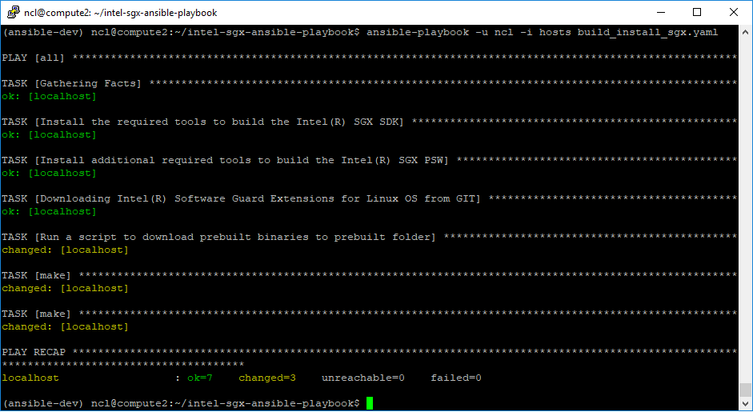
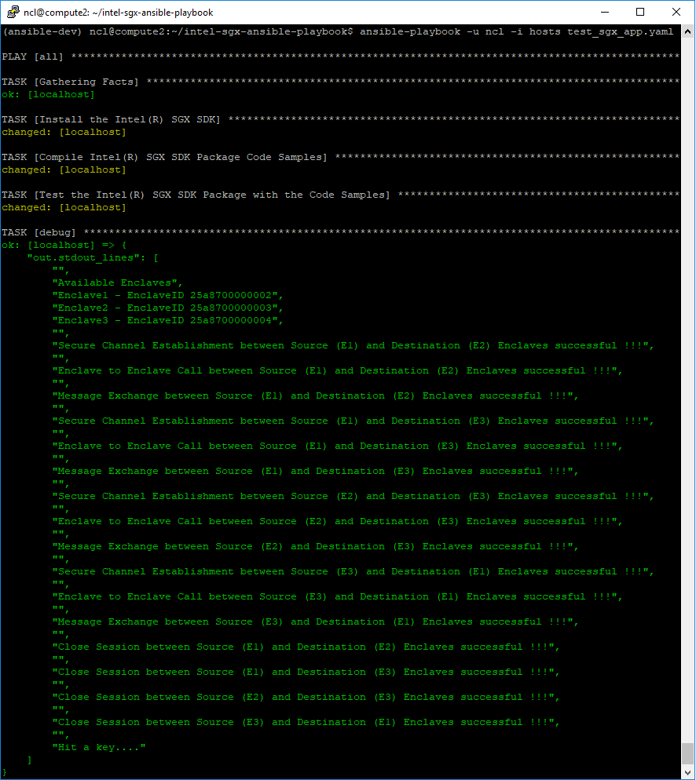

# Intel-sgx-ansible-playbook
Ansible playbook for building, installing and testing Intel SGX features in the Linux machine

Original guideline from [Intel(R) Software Guard Extensions for Linux* OS](https://github.com/intel/linux-sgx)

## Building Intel SGX SDX and Intel SGX PSW

Currently only support for building Intel SGX SDK because we don't hardware ready for Intel SGX.

To build please use this command:

```
ansible-playbook -u <username> -i hosts build_install_sgx.yaml
```
 
It will generate this kind of output.




## Installing Installing Intel SGX and Testing with Sample Application

Currently only support for installing and testing in Simulation mode because we don't have any hardware ready for Intel SGX.

To build please use this command:

```
ansible-playbook -u <username> -i hosts test_sgx_app.yaml
```
 
It will generate this kind of output.




